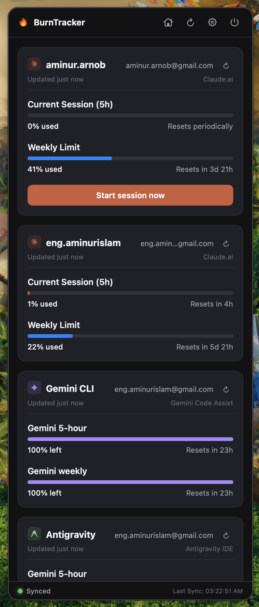

# BurnTracker 📊

A beautiful, lightweight, and modern macOS menu-bar utility built natively in **Swift + SwiftUI**. It resides in your macOS menu bar, letting you monitor rolling 5-hour session limits and weekly utilization quotas across multiple Anthropic **Claude.ai** accounts simultaneously — plus your local **Antigravity / Gemini CLI** usage.


[](https://github.com/aminurislamarnob/burnTracker/releases/latest)

---

## Download 📥

Grab the latest signed disk image from the [**Releases**](https://github.com/aminurislamarnob/burnTracker/releases/latest) page:

1. Download `BurnTracker-<version>.dmg` (e.g. [`BurnTracker-2.2.0.dmg`](https://github.com/aminurislamarnob/burnTracker/releases/download/v2.2.0/BurnTracker-2.2.0.dmg)).
2. Open the `.dmg` and drag **BurnTracker** into your **Applications** folder.
3. On first launch, right-click the app → **Open** → **Open anyway** (the app is signed to run locally, so macOS Gatekeeper shows a verification warning on a distributed build).

Requires macOS 13.0 (Ventura) or newer. Prefer to build it yourself? See [Building & Running](#building--running-).

---

## Key Features 🚀

- **Native Menu Bar App:** A single `MenuBarExtra` window that lives in the top status bar with no Dock icon. Clicking the icon toggles the compact widget; a power button in the header quits the app.
- **Minimal macOS Aesthetic:** Dark-themed cards with responsive status pulsing and native SF typography, matching Apple utility tools.
- **Multi-Account Quota Tracking:** Add and track multiple Claude accounts (e.g. *Personal*, *Work*, *Enterprise*) with custom labels.
- **Antigravity & Gemini CLI Quotas:** Link your local Antigravity app and Gemini CLI as **two separate providers**, each with its own card and sync, to track real Gemini and Claude/GPT usage buckets (weekly + 5-hour), read locally with no extra login.
- **Inline Account Editing:** Update a label or rotate an expired `sessionKey` directly from the settings list — changing the key automatically re-validates the account against Anthropic.
- **Configurable Auto-Refresh:** Choose how often quotas sync in the background (every 5, 10, 15, 30, or 60 minutes). Quotas also refresh instantly whenever you open the widget, and whenever your local `~/.claude` data changes.
- **Usage Alerts:** Get a native macOS notification the first time an account's 5-hour session crosses a threshold you pick (50%–95%), or switch alerts **Off**. Each account alerts once per session window and re-arms automatically after the session resets.
- **Live Syncing & Isolation:** Connects directly to Anthropic's private web endpoints. Accounts are fetched concurrently; if a key expires or fails, the warning is isolated to that card without affecting other active accounts.
- **Start a Session:** For an idle account, type a prompt and launch it straight into claude.ai in an embedded browser.
- **Privacy First:** Your Claude session cookies are stored purely locally under `~/.claude/tracker-settings.json` and are transmitted only to Anthropic's endpoints.
- **Retina-ready Tray Template:** A monochrome status-bar glyph that automatically adapts to light and dark macOS menu bars.

---

## App Interface Preview 📱



---

## How to Get Your `sessionKey` 🔑

To sync live usage metrics, you'll need the `sessionKey` cookie value for each account:

1. Open your browser and log into [claude.ai](https://claude.ai).
2. Right-click on the page and select **Inspect** to open Developer Tools.
3. Head to the **Application** tab (Chrome/Safari) or the **Storage** tab (Firefox).
4. Expand **Cookies** in the left sidebar menu and click `https://claude.ai`.
5. Find the row named `sessionKey` and copy its entire value (starting with `sk-ant-sid02-...`).
6. Click the gear icon `[⚙]` in the widget header, type a label (e.g. *Personal*), paste the key, and click **Add Account**.

> **Key expired?** `sessionKey` cookies are rotated periodically by Anthropic. When an account shows a *Sync Failed* warning, open the settings panel, click **Edit** on that account, and paste a fresh key — there's no need to remove and re-add it.

---

## Building & Running 🛠️

### Prerequisites
- macOS 13.0 (Ventura) or newer
- Xcode 16 or newer

### Run from Xcode
Clone the repository, then open the project and run it (⌘R):
```bash
open BurnTracker.xcodeproj
```
The app mounts its monochrome glyph in the status bar. It runs as a menu-bar accessory with no Dock icon; quit it via the power button in the widget header.

### Build from the command line
```bash
xcodebuild -project BurnTracker.xcodeproj -scheme BurnTracker -configuration Release -destination 'platform=macOS' build
```
The built `BurnTracker.app` is placed in Xcode's DerivedData `Build/Products/Release/` directory.

> *Note: the app is signed to run locally without a paid Apple Developer certificate, so macOS Gatekeeper may show a verification warning on a distributed build. To bypass it on first run, Right-Click the `.app` bundle, select **Open**, and click **Open anyway**.*

---

## Project Structure 📂

The Xcode project uses a **file-system-synchronized group**, so any file added under `BurnTracker/` is compiled automatically — no `project.pbxproj` edits needed.

```
burnTracker/
├── BurnTracker.xcodeproj/            # Xcode project
├── BurnTracker/
│   ├── BurnTrackerApp.swift          # @main App: MenuBarExtra + .accessory policy
│   ├── AppState.swift                # @MainActor ObservableObject — state + coordination
│   ├── Theme.swift                   # Color / design tokens
│   ├── Models/                       # Account, QuotaData, AntigravityData, TrackerSettings
│   ├── Services/                     # ClaudeService, AntigravityService, Persistence,
│   │                                 #   FileWatcher, NotificationManager, SessionAutomation
│   ├── Views/                        # RootView, Dashboard, cards, Settings, Components
│   ├── Utilities/                    # TimeFormat
│   └── Assets.xcassets/              # AppIcon, template MenuBarIcon, header icon
├── assets/                           # Icon sources & preview image
├── landing/                          # Marketing site (deployed via GitHub Pages)
└── README.md
```

---

## Security & Privacy 🔒

- All requests are initiated **directly** from your local machine to `claude.ai` (and, for Antigravity, your local CLI or Google's Cloud Code API).
- No central server, tracking service, or intermediate proxy is used.
- Keys are saved locally as standard JSON under `~/.claude/tracker-settings.json`. Session keys are stored in plaintext on disk — keep them local; they are never logged or sent anywhere except Anthropic.
